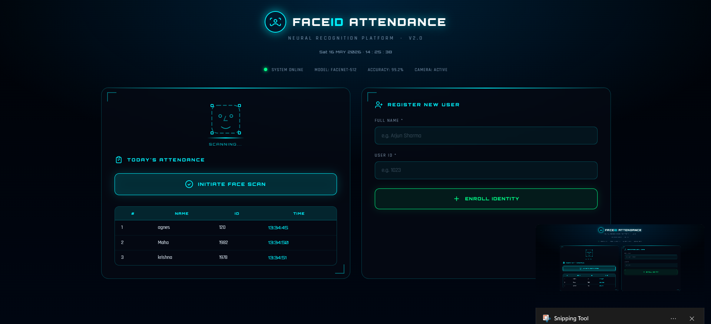

<div align="center">


# Face Recognition Attendance System

**Automated, real-time attendance tracking powered by computer vision**

[](https://python.org)
[](https://flask.palletsprojects.com)
[](https://opencv.org)
[](https://scikit-learn.org)
[](LICENSE)
[]()

[Features](#-features) · [Demo](#-demo) · [Installation](#️-installation) · [Usage](#-usage) · [Project Structure](#-project-structure) · [Contributing](#-contributing)

</div>

---

## 📌 Overview

A web-based attendance management system that uses **live face recognition** to automatically mark and log attendance — no manual roll-calls, no ID cards, no proxy. Built with **Flask**, **OpenCV**, and a **K-Nearest Neighbours** classifier, it captures, trains on, and identifies faces in real time via webcam, then records timestamped entries to a daily CSV.

> Designed for classrooms, offices, or any environment that needs friction-free, tamper-resistant attendance.

---

## ✨ Features

| Feature | Details |
|---|---|
| 🎥 **Live Face Detection** | Detects faces in real time using Haar Cascade classifiers |
| 🧠 **KNN Face Recognition** | Trains a KNeighborsClassifier on captured face encodings |
| 📋 **Auto Attendance Logging** | Marks presence with timestamp, skips duplicates automatically |
| 👥 **Multi-User Support** | Register and recognise multiple individuals simultaneously |
| 🌐 **Web Interface** | Clean Flask-powered UI — no desktop GUI dependency |
| 📁 **Daily CSV Reports** | Generates a new `Attendance-MM_DD_YY.csv` each day |
| 🗑️ **User Management** | View, register, and delete users from the web dashboard |
| 🚫 **Proxy Prevention** | Physical presence required — recognition only, no overrides |

---

## 🖥️ Demo

| Dashboard | Registered Users |
|---|---|
|  |

> **Live Recognition** — when attendance is started, a webcam window opens, draws a bounding box around each detected face, labels it with the recognised name, and logs the entry automatically.

---

## 🛠️ Tech Stack

| Layer | Technology |
|---|---|
| **Backend** | Python 3.7+, Flask |
| **Computer Vision** | OpenCV (`cv2`), Haar Cascade |
| **ML Classifier** | scikit-learn `KNeighborsClassifier` (k=5) |
| **Model Persistence** | joblib |
| **Data Storage** | CSV files via pandas |
| **Numerical Computing** | NumPy |

---

## 📁 Project Structure

```
face-recognition-based-attendance-system/
│
├── static/
│   ├── faces/                        # Per-user folders of training images
│   │   └── <Name>_<ID>/              # e.g. Neha_101/
│   └── face_recognition_model.pkl    # Trained KNN model (auto-generated)
│
├── templates/
│   ├── home.html                     # Dashboard — today's attendance + start button
│   └── listusers.html                # Registered users management page
│
├── Attendance/
│   └── Attendance-MM_DD_YY.csv       # Daily attendance logs (auto-created)
│
├── results/                          # Demo screenshots
├── app.py                            # Main Flask application
├── haarcascade_frontalface_default.xml
├── requirements.txt
└── README.md
```

---

## ⚙️ Installation

### Prerequisites

- Python 3.7 or higher
- pip
- A working webcam

### 1 — Clone the repository

```bash
git clone https://github.com/jk-neha/face-recognition-based-attendance-system-master.git
cd face-recognition-based-attendance-system-master
```

### 2 — Install dependencies

```bash
pip install -r requirements.txt
```

> **Note for Linux users:** OpenCV may require additional system packages:
> ```bash
> sudo apt-get install libgl1-mesa-glx libglib2.0-0
> ```

### 3 — Run the app

```bash
python app.py
```

Then open **http://127.0.0.1:5000** in your browser.

---

## 🚀 Usage

### Register a New User

1. On the home dashboard, enter the user's **Name** and **Roll/ID number**
2. Click **"Add New User"** — the webcam activates and captures 10 face samples automatically
3. The model retrains immediately after capture — the user is ready for recognition

### Mark Attendance

1. Click **"Take Attendance"** on the dashboard
2. A webcam window opens and scans for registered faces in real time
3. Recognised faces are labelled on screen and logged to today's CSV with a timestamp
4. Press **ESC** to stop the session — the dashboard refreshes with updated records

### View & Manage Users

- Click **"List Users"** to see all registered individuals
- Delete a user directly from the list; the model retrains automatically

### View Attendance Records

Each session writes to `Attendance/Attendance-MM_DD_YY.csv`:

```
Name,Roll,Time
Neha,101,09:03:21
Arjun,102,09:04:05
```

---

## 🔧 Configuration

Key parameters in `app.py` you can adjust:

| Parameter | Variable | Default | Description |
|---|---|---|---|
| Images captured per user | `nimgs` | `10` | Increase for better accuracy |
| KNN neighbours | `KNeighborsClassifier(n_neighbors=...)` | `5` | Lower = faster, less robust |
| Camera index | `cv2.VideoCapture(0)` | `0` | Change to `1`, `2` etc. for external webcams |
| Recognition tolerance | Euclidean distance (KNN) | Automatic | Retrain with more images to improve |

---

## ⚠️ Known Limitations

- **Low-light environments** — accuracy degrades without adequate lighting
- **Appearance changes** — masks, glasses, or drastic hairstyle changes may reduce recognition rate
- **Local storage only** — no database; all data is file-based
- **Single camera** — designed for one webcam at a time
- **Sequential blocking** — the webcam window blocks the Flask server thread during capture; suitable for local/demo use

---

## 🗺️ Roadmap

- [ ] Database integration (SQLite / PostgreSQL)
- [ ] REST API for multi-client support
- [ ] Email/SMS notification when attendance is marked
- [ ] Deeper learning model (face_recognition / dlib) for improved accuracy
- [ ] Export attendance as PDF/Excel
- [ ] Docker containerisation

---

## 🤝 Contributing

Contributions are welcome! To get started:

1. **Fork** the repository
2. **Create** a feature branch: `git checkout -b feature/your-feature`
3. **Commit** with a clear message: `git commit -m "Add: description of change"`
4. **Push** your branch: `git push origin feature/your-feature`
5. **Open** a Pull Request describing what you changed and why

Please follow [PEP 8](https://peps.python.org/pep-0008/) style and include comments for any non-obvious logic.

---

## 📄 License

This project is licensed under the **MIT License** — see the [LICENSE](LICENSE) file for details.

---

## 🙏 Acknowledgements

- [OpenCV](https://opencv.org/) — real-time computer vision
- [scikit-learn](https://scikit-learn.org/) — KNN classifier
- [Flask](https://flask.palletsprojects.com/) — lightweight web framework
- [pandas](https://pandas.pydata.org/) — CSV handling

---

<div align="center">

Made with ❤️ by [jk-neha](https://github.com/jk-neha)

If this project helped you, please consider giving it a ⭐

</div>
